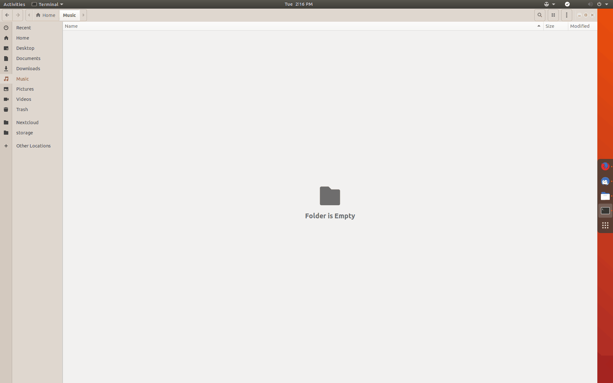

WinTile: Windows 10 window tiling for GNOME
===========================================
WinTile is a hotkey driven window tiling system for GNOME that imitates the standard `Win-Arrow` keys of Windows 10, allowing you to maximize, maximize to sides, or 1/4 sized to corner a window using just `<Super>`+`<Arrows>`.

WinTile also supports:
- 2, 3, or 4 columns for standard or ultrawide monitors
- Toggling of "maximize" mode, which adds/removes GNOME animations

WinTile can be found on the GNOME Extension site:

https://extensions.gnome.org/extension/1723/wintile-windows-10-window-tiling-for-gnome/

